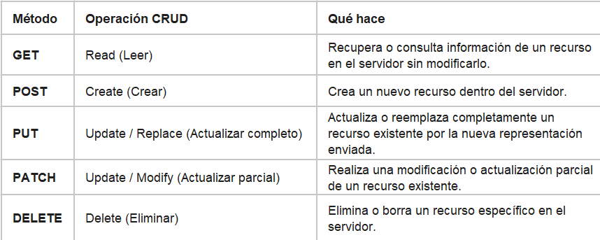

# taller-postman-orozco

# Marco Contextual
Tarea 1 #### ¿Qué es una API REST?
Una API Rest es un conjunto de reglas que se usan  con el fin de estructurar una aplicación para permitir su comunicación con otras aplicaciones haciendo uso de la internet por medio del protocolo HTTP

Qué significa que una API sea «REST»

Que una API sea REST significa que trata la información como recursos identificables por URLs, utiliza los métodos HTTP estándar para interactuar con ellos, no guarda estado de sesión en el servidor y entrega representaciones ligeras (casi siempre JSON) para mantener el sistema desacoplado y escalable.

Qué es un recurso y qué es un endpoint

Un recurso es la unidad que representa la informacion que se esta pidiendo por medio del llamado a la api, por ejemplo si se necesita listar productos, el recurso sería producto y la petición sería GET
El endpoint por otro lado representa la URI a la cual se hace la petición un ejemplo usando el recurso anterior serí: /localhost/api/producto

## Fuente

Fielding, R. T. (2000). Architectural Styles and the Design of Network-based Software Architectures [Tesis doctoral, University of California, Irvine]. UC Irvine Electronic Theses and Dissertations. https://ics.uci.edu/~fielding/pubs/dissertation/top.htm

# Métodos HTTP

## Fuente
Internet Engineering Task Force. (2022). HTTP Semantics (RFC N.º 9110). https://www.rfc-editor.org/rfc/rfc9110.html

# Códigos de estado

1xx Son informaticos indican que la petición fue recibida y el servidor continúa el proceso 

2xx Simbolizan éxito en las peticiones enviadas, indicando que la acción solicitada fue recibida, entendida y aceptada correctamente

3xx Simbolizan redirección indicando que el cliente debe tomar medidas adicionales para completar la petición

4xx Simbolizan errores a nivel del cliente indicando que la solicitud contiene sintaxis incorrecta o no puede ser procesada por culpa del cliente.

5x Simbolizan errores a nivel del servidor indicando que el servidor falló al intentar procesar una solicitud aparentemente válida.

## Ejemplos

1. 100 Continue: El servidor confirma que recibió los encabezados de la solicitud y que el cliente puede proceder a enviar el cuerpo (body).

2. 200 Ok: La solicitud HTTP estándar se procesó correctamente y el servidor devuelve los datos solicitados. 

3. 301 Moved Permanently: El recurso solicitado ha sido trasladado permanentemen a una nueva URL especificada en la respuesta.

4. 404 Not Found: El servidor no pudo encontrar el recurso solicitado (La URL está mal escrita o ya no existe).

5. 500 Internal Server Error: Ocurrió una condición inesperada en el backend (Un bug en el código, fallo en la base de datos, entre otros).

